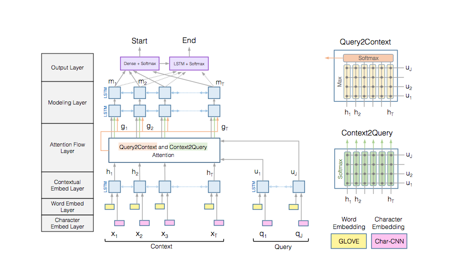
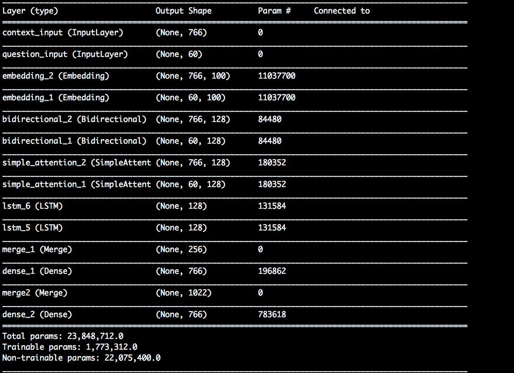
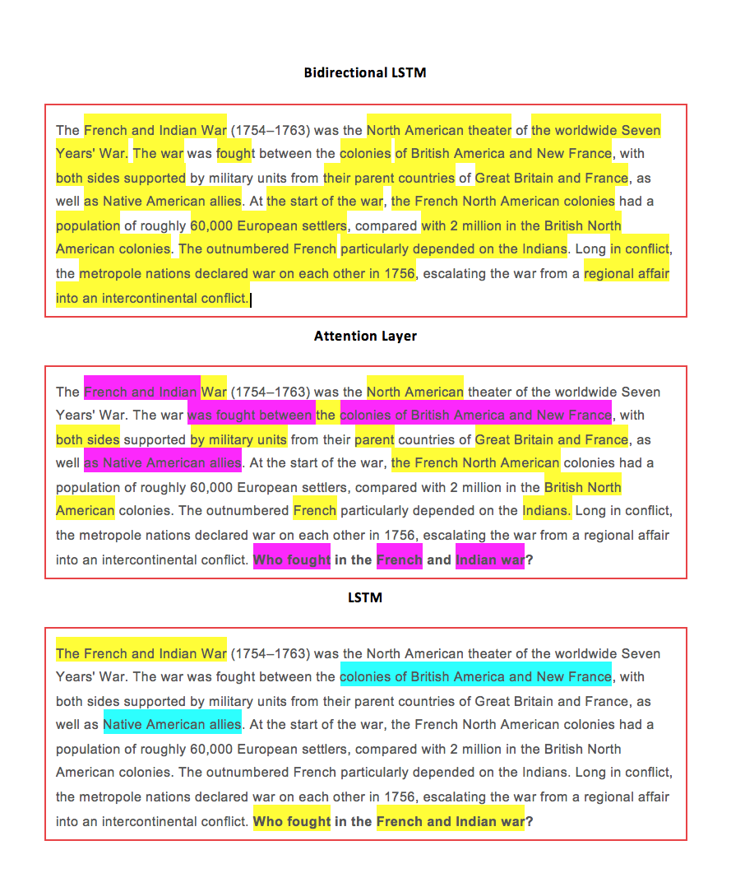
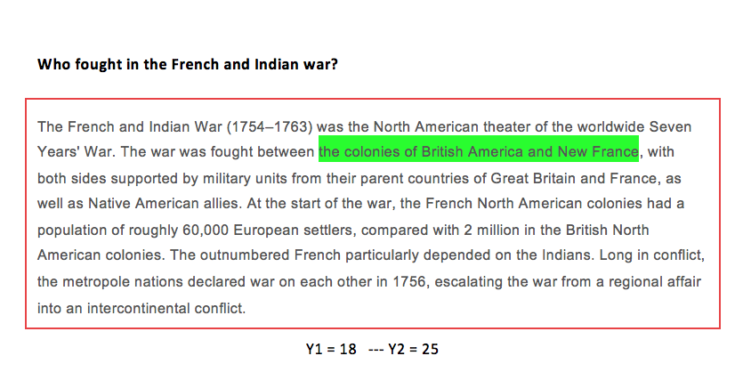
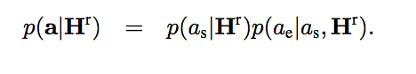

# Context

The Stanford Question Answering Dataset (SQuAD) is a reading comprehension dataset consisting of questions posed by crowdworkers on a set of Wikipedia articles. The answer to every question is a segment of text, or span, from the corresponding reading passage. There are 100,000+ question-answer pairs on 500+ articles.

# Content

There are two files to help you get started with the dataset and evaluate your models:

Download [here](https://rajpurar.github.io/SQuAD-explorer/)

train-v1.1.json 
dev-v1.1.json

Keras 2.0.4 
Python: 2.7 & 3.x
TensorFlow: 1.0.1

# Model 

 **Inspired by:** Minjoon Seol, Aniruddha Kembhavi, Ali Farhadi, Hananneh Hajishirzi

  University of Washington, Allen Institute for Artificial Intelligence

# In Keras 

3

# Intuitive Explanation

----

----

 #  Predictions 
----

# WAITING FOR THE NEURAL NETWORK TO TRAIN 
----

---
# Evaluation 

 Chau's BiDAF Model (Single)      -- 5Epos --        EM : 50.141 - F1: 60.981 
